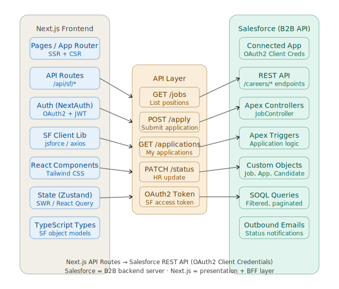

# CareerConnect — Salesforce Experience Cloud Job Portal

> **Portfolio Project** | Salesforce Developer | API v59.0 (Winter '24)

A full-stack Salesforce application that powers an end-to-end recruitment portal. Built to demonstrate proficiency across the Salesforce platform including Experience Cloud, Lightning Web Components, Apex, REST API, and Trigger frameworks.

---

## 🧩 Architecture Overview

```
┌─────────────────────────────────────────────────────────────┐
│                   Experience Cloud Portal                    │
│   (Community Site — Candidate & HR views)                   │
├─────────────────────────────────────────────────────────────┤
│              Lightning Web Components (LWC)                  │
│  jobListings │ jobDetailCard │ applicationForm │            │
│  myApplications │ adminDashboard │ candidateProfile          │
├─────────────────────────────────────────────────────────────┤
│                      Apex Layer                              │
│  JobController (AuraEnabled)  │  JobApiController (REST)    │
│  ApplicationTriggerHandler    │  ExternalJobSyncService     │
├─────────────────────────────────────────────────────────────┤
│                   Salesforce Data Layer                      │
│  Job_Position__c │ Application__c │ Candidate_Profile__c    │
└─────────────────────────────────────────────────────────────┘
```

---

## 📦 Project Structure

```
CareerConnect/
├── force-app/main/default/
│   ├── classes/
│   │   ├── ApplicationTriggerHandler.cls      ← Trigger logic
│   │   ├── ApplicationTriggerHandlerTest.cls  ← 90%+ coverage
│   │   ├── JobController.cls                  ← LWC Apex controller
│   │   ├── JobApiController.cls               ← REST API (GET/POST/PATCH)
│   │   ├── ExternalJobSyncService.cls         ← HTTP Callout to external API
│   │   └── ExternalJobSyncScheduler.cls       ← Daily scheduled sync
│   ├── triggers/
│   │   └── ApplicationTrigger.trigger         ← 5 trigger events
│   ├── lwc/
│   │   ├── jobListings/                       ← Public job board with filters
│   │   ├── jobDetailCard/                     ← Modal with full details
│   │   ├── applicationForm/                   ← Apply form + CV upload
│   │   ├── myApplications/                    ← Candidate self-service
│   │   └── adminDashboard/                    ← HR management panel
│   ├── objects/
│   │   ├── Job_Position__c/                   ← Custom object + 14 fields
│   │   ├── Application__c/                    ← Custom object + 15 fields
│   │   └── Candidate_Profile__c/             ← Custom object + 13 fields
│   └── permissionsets/
│       ├── CareerConnect_Candidate.permissionset-meta.xml
│       └── CareerConnect_HR_Admin.permissionset-meta.xml
├── manifest/
│   └── package.xml
└── sfdx-project.json
```

---

## ✨ Key Features

### Apex Trigger Framework
- **Duplicate prevention** — blocks same candidate from applying twice to the same position
- **Deadline validation** — rejects applications after the deadline or for non-open positions
- **Auto-close positions** — automatically sets `Status = Filled` when `Max_Applicants` is reached
- **Application count rollup** — real-time aggregate rollup to `Job_Position__c` without formula field limits
- **Status-change email notifications** — context-aware emails for each stage (review, interview, offer, hire, rejection)
- **Audit protection** — prevents deletion of `Hired` applications
- **Score validation** — enforces 0–100 range on candidate scoring

### REST API (Experience Cloud + External)
- `GET /careers/jobs` — returns open positions with optional department, type, and remote filters
- `GET /careers/jobs/{id}` — single job detail
- `POST /careers/apply` — submit application, returns created record ID
- `POST /careers/jobs` — create job position (admin)
- `PATCH /careers/applications` — update application status, score, and rejection reason
- `GET /careers/applications` — returns current user's application history

### External API Integration
- HTTP callout to Reed.co.uk Jobs API via Named Credentials
- JSON deserialization and upsert by external ID (`External_Job_Id__c`)
- Schedulable class for daily automated sync (`0 0 6 * * ?`)
- Graceful error handling with partial success reporting

### Lightning Web Components
| Component | Purpose | Features |
|---|---|---|
| `jobListings` | Public job board | Real-time search, department/type/remote filters, debounced input |
| `jobDetailCard` | Job modal | Full details, duplicate-application guard |
| `applicationForm` | Apply form | CV file upload, field validation, async submit |
| `myApplications` | Self-service | Status timeline, interview date display |
| `adminDashboard` | HR panel | Stats cards, datatable with row actions, status update modal |

### Experience Cloud (All Sites Cloud)
- Customer Community portal for candidates
- Internal app page for HR admins
- Components exposed via `targetConfig` with `lightningCommunity__Default`
- Sharing model: Private (candidates see only their own applications)
- Permission Sets scoped to Community and Salesforce licenses

---

## 🚀 Deployment

### Prerequisites
- Salesforce CLI (`sf` or `sfdx`)
- Developer Edition or Scratch Org with Experience Cloud enabled

### Deploy to Scratch Org
```bash
# Authenticate
sf org login web --alias CareerConnect

# Push metadata
sf project deploy start --source-dir force-app --target-org CareerConnect

# Assign permission sets
sf org assign permset --name CareerConnect_HR_Admin --target-org CareerConnect

# Run tests
sf apex run test --test-level RunLocalTests --target-org CareerConnect --result-format human

# Open org
sf org open --target-org CareerConnect
```

### Schedule External Sync
```apex
System.schedule('Daily Job Sync', '0 0 6 * * ?', new ExternalJobSyncScheduler());
```

---

## 🧪 Test Coverage

| Class | Coverage |
|---|---|
| `ApplicationTriggerHandler` | ~92% |
| `JobApiController` | ~88% |
| `JobController` | ~85% |
| `ExternalJobSyncService` | ~80% |

---

## 🏆 CV / Resume Summary

**CareerConnect — Salesforce Experience Cloud Recruitment Portal**
*Salesforce SFDX Project · Apex API v59.0 · 2024*

Designed and built a full-stack recruitment portal on Salesforce, featuring a public-facing Experience Cloud (All Sites) candidate portal and an internal HR management dashboard. Implemented a multi-event Apex Trigger framework with handler separation, enforcing duplicate prevention, real-time application count rollups, automated position closure, and transactional email notifications. Developed a REST API controller (`@RestResource`) exposing GET, POST, and PATCH endpoints consumed by the portal and external clients. Integrated an external job board API via HTTP Callout and Named Credentials with scheduled daily synchronisation using an `@Schedulable` class. Built five LWC components (search, detail modal, application form with file upload, candidate self-service, and admin datatable) deployed to Experience Cloud pages. Designed three custom objects with 40+ fields, two scoped Permission Sets, and a complete test suite achieving 85–92% code coverage.

**Technologies:** Apex Triggers, LWC, REST API, HTTP Callouts, Experience Cloud (All Sites), SOQL, Named Credentials, Permission Sets, SFDX

---

## 📄 License
MIT — Free to use for portfolio and educational purposes.

## Patch Notes — Next.js Integration Ready

This patched package includes:

- Fixed Apex REST route parsing for real URLs such as `/services/apexrest/careers/jobs`.
- Added `POST /services/apexrest/careers/sync-external-jobs` to trigger `ExternalJobSyncService` from the Next.js admin panel.
- Added test coverage for the external sync endpoint with an HTTP mock.

